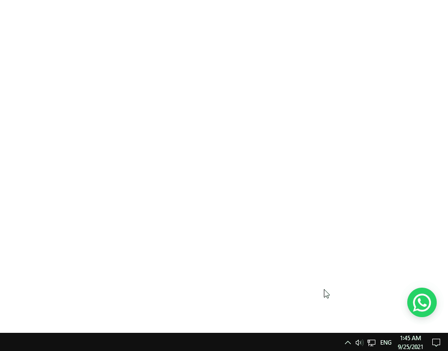

# React Floating Whatsapp

> Simple react component for adding a floating WhatsApp button to your project.

[](https://www.npmjs.com/package/react-floating-whatsapp2)


<p align="center">
  
</p>

## Install

#### npm

```bash
npm i react-floating-whatsapp2
```

#### Yarn

```bash
yarn add react-floating-whatsapp2
```


## Usage

```jsx
import React from 'react'
import { FloatingWhatsApp } from 'react-floating-whatsapp2'

export default function App() {

  return (
      <FloatingWhatsApp {/*  Props  */} />
  )
}
```

### Props

| Prop                    |     Type      | Options  | Description                                                                                                               |               Default                |
| ----------------------- | :-----------: | -------- | ------------------------------------------------------------------------------------------------------------------------- | :----------------------------------: |
| `phoneNumber`           |    String     | Required | Phone number in [intenational format](https://faq.whatsapp.com/general/contacts/how-to-add-an-international-phone-number) |             `1234567890`             |
| `accountName`           |    String     | Required | Account username                                                                                                          |            `Account Name`            |
| `onClick`               |   Function    | Optional | Callback function fires on click                                                                                          |                 `-`                  |
| `onSubmit`              |   Function    | Optional | Callback function fires on submit with event and form input value passed                                                  |                 `-`                  |
| `onClose`               |   Function    | Optional | Callback function fires on close                                                                                          |                 `-`                  |
| `onLoopDone`            |   Function    | Optional | Callback function called when notification loop done                                                                      |                 `-`                  |
| `onNotification`        |   Function    | Optional | Callback function fired when notification runs                                                                            |                 `-`                  |
| `avatar`                |    String     | Optional | Change user avatar using [static assets](https://create-react-app.dev/docs/adding-images-fonts-and-files/)                |              `UI Face`               |
| `statusMessage`         |    String     | Optional | Text below the account username                                                                                           |  `Typically replies within 1 hour`   |
| `chatMessage`           |    String     | Optional | Text inside the chat box.                                                                                                 | `Hello there! 🤝 \nHow can we help?` |
| `placeholder`           |    String     | Optional | Input placeholder.                                                                                                        |          `Type a message..`          |
| `messageDelay`          |    Number     | Optional | Time delay after which the chatMessage is displayed (in seconds).                                                         |                 `2`                  |
| `darkMode`              |    Boolean    | Optional | Dark style.                                                                                                               |               `false`                |
| `allowClickAway`        |    Boolean    | Optional | Closes the chat box when user clicks outside                                                                              |               `false`                |
| `allowEsc`              |    Boolean    | Optional | Closes the chat box when `Escape` key is pressed                                                                          |               `false`                |
| `className`             |    String     | Optional | CSS className applied to the main wrapping `Div`                                                                          |         `floating-whatsapp`          |
| `buttonClassName`       |    String     | Optional | CSS className applied to button                                                                                           |      `floating-whatsapp-button`      |
| `style`                 | CSSProperties | Optional | Inline style applied to the main wrapping `Div`                                                                           |                 `{}`                 |
| `buttonStyle`           | CSSProperties | Optional | Inline style applied to button                                                                                            |                 `{}`                 |
| `chatboxHeight`         |    Number     | Optional | Control chat box height                                                                                                   |                `320`                 |
| `chatboxClassName`      |    String     | Optional | CSS className applied to chat box                                                                                         |     `floating-whatsapp-chatbox`      |
| `chatboxStyle`          | CSSProperties | Optional | Inline style applied to chat box                                                                                          |                 `{}`                 |
| `notification`          |    Boolean    | Optional | Allow notifications (Disabled after user open the chat box)                                                               |               `false`                |
| `notificationDelay`     |    Number     | Optional | Time delay between notifications in seconds                                                                               |                 `60`                 |
| `notificationSound`     |    Boolean    | Optional | Allow notification sound                                                                                                  |               `false`                |
| `notificationSoundSrc`  |    String     | Optional | Notification sound custom src                                                                                             |                 `-`                  |
| `notificationLoop`      |    Number     | Optional | Repeat notifications loop                                                                                                 |                 `0`                  |
| `notificationStyle`     | CSSProperties | Optional | Inline style applied to notification                                                                                      |                 `-`                  |
| `notificationClassName` |    String     | Optional | CSS className applied to notification indicator                                                                           |   `floating-whatsapp-notification`   |

<br />

[](https://codesandbox.io/s/react-floating-whatsapp2-183py)

### Credits 

[awran5](https://github.com/awran5/react-floating-whatsapp/)

i forked this project because owner is inactive from last many months also need some extra functionality and more stability 

### License

MIT © [AdarshHatkar](https://github.com/AdarshHatkar/)
